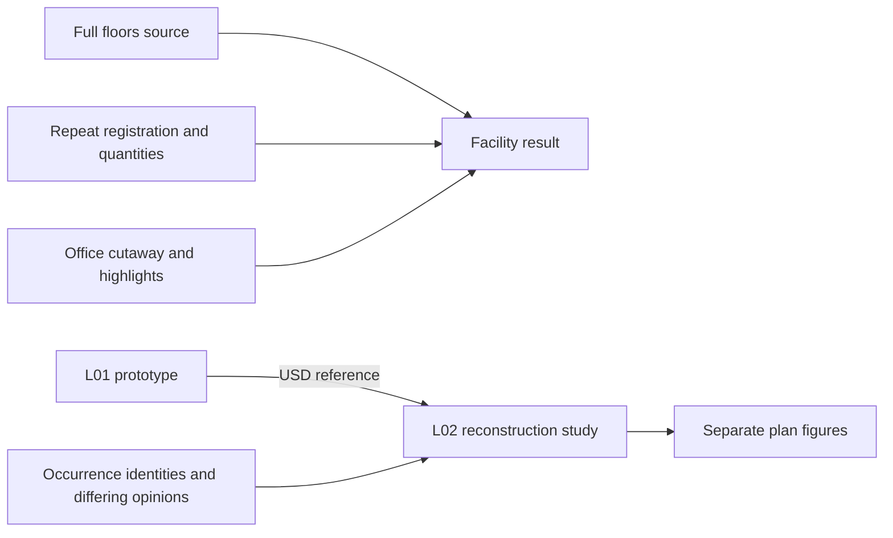

# Repeated floors and the quantity schedule

## 1 The problem

A copied floor can change after drawings and procurement have assumed that it
repeats another. Moving and lengthening a partition affects quantities, while
an un-keyed schedule hides the level where the difference occurred. Repetition
needs explicit exceptions and a comparison against the actual prototype.

## 2 The data as it arrives

The example consumes the complete published `floors` variant from data-centre
v0.4.8. Its manifest records the unchanged v0.4.5 publication. Core containers,
classified occurrences, catalog inherits, axes, mesh bodies and exported
quantities are already present. The source manifest supplies census expectations:
2,983 elements, 3 levels, 39 spaces, 3,022 meshes and 6,212 ports.

A small section overlay converts consistent exported wall widths into homogeneous
`AecoBuildUpAPI` sections with unspecified materials. Flat exports retain level
elevations in child placement; registration measures the dominant translation
of same-class/type/orientation elements. Here it is (0, 0, 3) m. Tied registration
fails. Reconstruction can normalize the level frame while compensating child
transforms, preserving every world-space point.

## 3 The model in USD

Core owns containment, classification, types and identity. `AecoRepeatAPI` adds
`aeco:repeat:prototype` and the derived `aeco:repeat:offset` to an existing spatial
container. Its built-in `CollectionAPI:deviations` uses explicit-only membership.
Each member needs a nonblank reason in `customData` at `aeco:repeat:reason`.
A missing element is declared through its prototype member. An absent or blank
reason never suppresses drift.

`AecoQuantityAPI` and `aeco:qto:` remain unchanged. Length, area, volume and count
carry the existing source identity, measurement method and resolved-input hash
in property customData. The schema marks quantities and offset as derived;
writers put values in separate layers. No second identity or new typed prim is
introduced. Stock USD uses the stage's fallback declarations.

## 4 Workflow

1. Configure paths as described in README Build and check, then run
   `env -u PYTHONPATH "$AECO_PYTHON" examples/datacentre/run.py --publish`.
   The harness resolves the pinned source through the ignored `inputs/source`
   alias and composes the input overlays.
2. Inspect `out/diff.json`: classification, inherited type and placement match
   elements; equal shape with displacement is `moved`, while changed shape is
   `changed`, including a partition that also moved. Names and identities do not
   drive matching. Review ambiguous matches rather than assuming design intent.
3. Inspect `out/schedule.json`: keyed, un-keyed and `repeat_resolved` schedules.
   The last repeats the prototype and ignores exceptions, representing the
   original procurement assumption. CLI: `aeco-repeat takeoff --repeat-resolved`.
4. Inspect the full `result/example.usdc` and `result/vanilla.png`. Quantities
   and offset are derived separately. Presentation hides the office roof and
   highlights changed bodies with derived bounding outlines. All source prims,
   identities, meshes and world transforms remain intact.
5. Inspect `out/composition.json` and `result/layers/out/composition/` for the
   separate `aeco-repeat compose` proof. One reference plus occurrence identities,
   differing values and additions reproduces L02. Its explicit path map records
   prototype child names; the facility result retains original source paths.
6. Declare reviewed exceptions in the deviations collection with reasons, then
   rerun `aeco-repeat diff` and validators. Zero declarations are authored in
   the example, so both changes remain visible.

## 5 Validation

| Rule | Severity | Defect drill |
|---|---|---|
| `RepeatDrift` | error | Undeclared 1 m displacement, invalid prototype links and cycles; a valid declaration suppresses the corresponding change. |
| `DeviationWithoutReason` | error | Missing, blank or dangling deviation reason. |
| `QuantityStale` | error | Changed input axis, edited quantity, or incorrect source/method/hash. |

The Python plugin registers all three rules with UsdValidation. Tests call the
registry through ValidationContext. The gate requires all eight core validators
to import and load. The full result has zero core errors and retains exactly
the two `proxyClassified` warnings already present on source utility intakes;
any added warning fails. Exactly two `RepeatDrift` errors are expected, with
zero stale quantities or missing reasons. Error-site serialization uses
`GetPrim().GetPath()` for the USD 26.8 runtime.

Publication checks compare every source prim, identity, source mesh and world
placement against the crate, including unrelated levels and yard equipment.
A defect drill removes unrelated equipment; other drills change identity,
placement and mesh data. Reconstruction independently checks all occurrence
prims, world transforms, topology and mesh points at default time within 1e-6.
Reference-broadcast tests exercise later unoverridden prototype edits.

## 6 The example on the demo data centre

L02 repeats L01 in the office wing. The pinned variant measures:

| Observation | Result |
|---|---:|
| Matched element pairs | 28 |
| Changed partition | 1 m east; extended 3.2 m south |
| Extra door / declared deviations | 1 / 0 |
| Undeclared differences | 2 |
| Partition length L01 / L02 | 43.0 / 46.2 m |
| Door count L01 / L02 | 5 / 6 |
| Un-keyed minus repeated partition length | +3.2 m |
| Un-keyed minus repeated door count | +1 |
| Reference reconstruction | 71 prims, 944 vertices, maximum error 8.89e-16 |
| Differing / occurrence / additions layer lines | 267 / 686 / 50 |

The complete 12,337-prim source is retained in the facility result. The
[vanilla render](../examples/datacentre/result/vanilla.png) shows the office
cutaway in context. Amber is the shifted and extended partition; green is the
extra door. [L01](../examples/datacentre/renders/l01.png) and
[L02](../examples/datacentre/renders/l02.png) plan figures remain separate
bounding-footprint studies. All renders use stock USD and obey the image caps.
The manifest records the actual crate count, total bytes and source hashes.

The source export’s prototype hint is published as `aeco:props:DC_Repeat:Prototype`, preserving its value. USD cannot rename a weaker-layer property through an overlay, so this metadata migration runs on the flattened crate and archived own layers. Source files remain unchanged.

## 7 Trade-offs and alternatives

Copies permit independent editing but need comparison. A USD reference
broadcasts prototype edits and makes differing opinions inspectable; it still
needs validation and cannot establish approval. Keeping reconstruction separate
preserves all source names in the facility view and avoids duplicate identities
when referenced children use different names from exported occurrences.

Gross wall takeoff uses axes, build-up widths and measured body height, without
subtracting openings or solving joins. Body surface area and closed tessellated
volume use different method labels and must not be mixed into an unqualified
commercial quantity. Unavailable dimensions are counted explicitly. Dense arrays
of identical objects need review of the reported pairs.

## 8 Out of scope and open questions

Time-sampled or instanced prototype hierarchies, exact kernels, joins and opening
evaluation, cost rates, approval records and external-overlay repair after path
remapping remain outside scope. Non-manifold meshes have no volume quantity.
Circular arcs require uniform scaling and orthogonal transforms. Roof visibility
and highlight outlines are presentation only; they do not change design intent.

## 9 Status

v0.2.1: 44 checks, 0 failed, 0 not run; structure 29/0; 18 pytest tests passed.
The pinned publication passes ResultStale. Schema, tools, defect drills and the full-facility publication are
implemented. The source's two proxy-classification warnings remain visible.
See [CHANGELOG](../CHANGELOG.md#021) for current gate, test and Nix evidence;
the two-layout relocation measurements remain recorded under v0.2.0. Nix is not proven. No design approval is inferred from a green gate.
