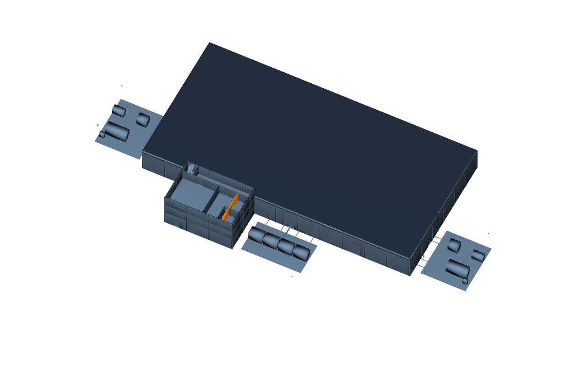

# Repeat containers and quantities

A repeated floor is a reference to a spatial prototype. Apply `AecoRepeatAPI`
to the repeated container, point `aeco:repeat:prototype` at the source and derive
the offset from their frames. Flat exports can be registered by the dominant
translation of matching classified and typed elements. A tied registration is
an error. Comparison is deterministic and does not depend on names or ids.

[The minimal stage](../examples/minimal.usda) contains two clean repeated levels.
[The complete example](../../examples/datacentre/README.md) measures a changed
floor from the published demo facility. No new typed prim is introduced.

`CollectionAPI:deviations` uses explicit members. Put the nonblank reason in
`customData` under `aeco:repeat:reason` on each member; include the prototype
member to declare a missing element. Unreasoned declarations do not suppress drift.

`AecoQuantityAPI` stores SI length, area, volume and occurrence count. Each
quantity's `customData` records `aeco:qto:source` (the existing `aeco:id`),
`aeco:qto:method` and `aeco:qto:stamp` (SHA-256 of resolved measurement inputs).
No second identity is created. Unavailable dimensions remain unauthored and
are counted separately in the schedule. Values are derived into their own layer.

The office cutaway shows the full facility with the changed partition in amber
and the extra door in green. Separate plan studies remain in the example's
renders directory; their bounding footprints simplify openings.
